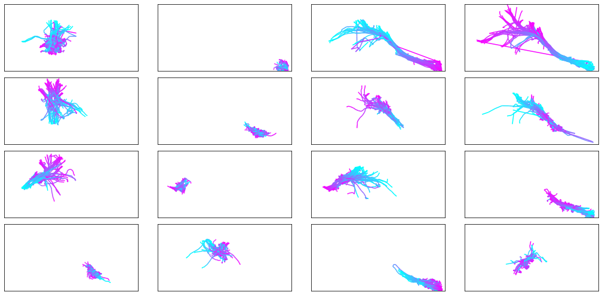
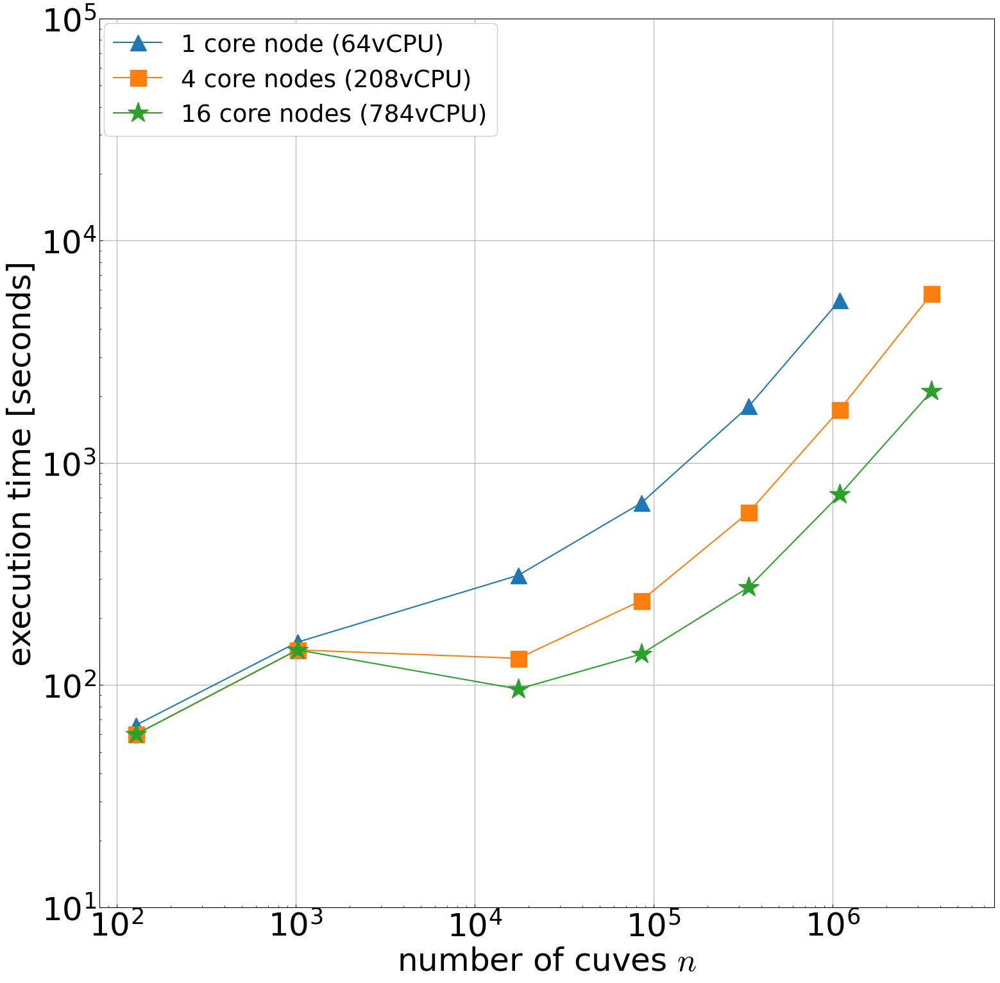

# Spark-curves

[](https://maven-badges.herokuapp.com/maven-central/io.github.toyotainfotech/spark-curves_2.13)
[](https://github.com/ToyotaInfoTech/spark-curves/actions/workflows/scala.yml)

Spark-curves provides SQL functions and ML Classes on Apache Spark about curve calculations such as curve similarity, clustering, etc.

## Setup

### SBT Settings

Apache Spark SQL & MLlib 3.5.0 (on Scala 2.12 or 2.13) are required to use Spark-curves.

```scala
libraryDependencies ++= Seq(
  "io.github.toyotainfotech" %% "spark-curves" % "0.4.0",
  "org.apache.spark" %% "spark-sql" % "3.5.0" % Provided,
  "org.apache.spark" %% "spark-mllib" % "3.5.0" % Provided
)
```

### Registration of SQL Functions

```scala
import io.github.toyotainfotech.spark.curves.sql.functions.registerCurveFunctions

val spark: SparkSession = ??? // use a SparkSession instance in your Spark environment

registerCurveFunctions(spark.sessionState.functionRegistry)
```

## Examples

### Curve Similarity

```sql
> SELECT discrete_frechet_distance(array(array(0d, 0d), array(2d, 0d), array(6d, 0d)), array(array(0d, 1d), array(2d, 1d), array(3d, 1d), array(6d, 1d)))
1.414
```

```sql
> SELECT continuous_dynamic_time_warping(array(array(-1d, 1d), array(0d, 1d), array(0d, 2d), array(1d, 2d), array(2d, 2d), array(3d, 2d), array(3d, 1d), array(4d, 1d)), array(array(-1d, 0d), array(0d, 0d), array(3d, 0d), array(4d, 0d)))
2.722
```

### Curve Clustering

```scala
val klClustering = new KLClustering()
  .setK(2)
  .setL(16)
  .setIter(2)
  .setCurveSimilarityFunc("continuous_frechet_distance")
  .setCurveSimplifyFunc("polyline_sample_equidistant")
  .setPointsCenterFunc("smallest_circle_center")
  .setInputCurveCol("curve")
  .setInputCurveAxisFields(Array("x", "y"))
  .setOutputClusterIndexCol("clusterIndex")
  .setOutputSimilarityCol("similarity")
  .setOutputMatchingCurveCol("matching_curve")

val klClusterModel = klClustering.fit(trajectories)
val result = klClusterModel.transform(trajectories)
```

## Documentation

See [API](docs/generated/api.md).

## Performance

### Curve Clustering

The following experiment is clustering of up to 3,578,281 curves on Amazon EMR.




See [DEIM 2023 paper (Japanese)](https://proceedings-of-deim.github.io/DEIM2023/2b-2-3.pdf) for details.

## License

```
Copyright 2023 TOYOTA MOTOR CORPORATION

Licensed under the Apache License, Version 2.0 (the "License");
you may not use this file except in compliance with the License.
You may obtain a copy of the License at

       http://www.apache.org/licenses/LICENSE-2.0

Unless required by applicable law or agreed to in writing, software
distributed under the License is distributed on an "AS IS" BASIS,
WITHOUT WARRANTIES OR CONDITIONS OF ANY KIND, either express or implied.
See the License for the specific language governing permissions and
limitations under the License.
```
